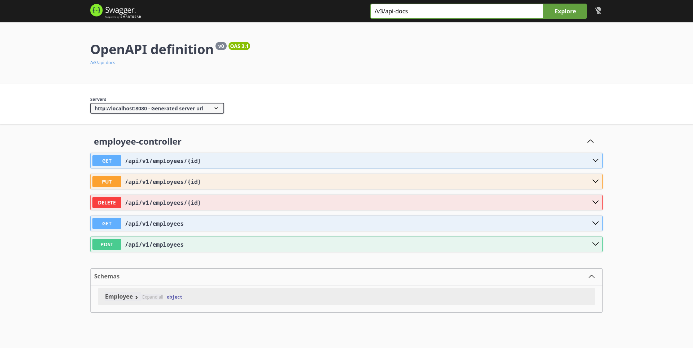

<h3 align="center">Corporate Directory API</h3>

<p align="center">
    <strong>
    A robust REST API for employee management, built as a target for Contract Testing practice.
    </strong>
</p>
<p align="center">
    
    
    <a href="#license">
        
    </a>
</p>
<p align="center">
    <a href="#features">Features</a> •
    <a href="#tech-stack">Tech Stack</a> •
    <a href="#api-endpoints">API Endpoints</a> •
    <a href="#build-and-run">Build and Run</a> •
    <a href="#license">License</a>
</p>
<hr>

A modern, containerized backend service for managing corporate employees. Developed strictly to serve as a "target application" (a victim) for practicing API Contract Testing, automated QA tools development, and exploring the Spring Boot ecosystem.

<br>
<p align="center">
  
</p>
<br>

## Features

- **CRUD Operations**: Full management of employee records (Create, Read, Update, Delete).
- **Data Validation**: Strict payload validation using Jakarta Constraints (e.g., proper email formatting, positive IDs, non-blank fields).
- **Centralized Error Handling**: Unified API responses for `400 Bad Request`, `404 Not Found`, and `409 Conflict` (Email uniqueness checks) via `@RestControllerAdvice`.
- **Auto-generated Documentation**: Real-time OpenAPI (Swagger) specification generation.
- **Zero-Config Startup**: Thanks to `spring-boot-docker-compose`, the application automatically spins up and configures the PostgreSQL database without manual Docker commands.

## Tech Stack

- **Core**: Java 21, Spring Boot 3.5.15
- **Database**: PostgreSQL (Dockerized), Spring Data JPA, Hibernate
- **Tools**: Lombok, Maven Wrapper
- **Documentation**: Springdoc OpenAPI (Swagger 3)

## API Endpoints

Base URL: `http://localhost:8080/api/v1/employees`

| Method | Endpoint | Description | Expected Status |
| :--- | :--- | :--- | :--- |
| `GET` | `/` | Get all employees | `200 OK` |
| `GET` | `/{id}` | Get employee by ID | `200 OK` / `404 Not Found` |
| `POST` | `/` | Create a new employee | `201 Created` / `400 Bad Request` / `409 Conflict` |
| `PUT` | `/{id}` | Update existing employee | `200 OK` / `404 Not Found` / `409 Conflict` |
| `DELETE` | `/{id}` | Remove employee by ID | `204 No Content` / `404 Not Found` |

## Build and Run

### Prerequisites
Make sure you have **Java 21** and **Docker** installed and running on your system. 

### 1. Run the Application
You don't need Maven installed locally, and you **don't need to manually start the database**. The application uses Spring Boot's Docker Compose support. Just clone and run:

```bash
git clone https://github.com/b1sted/CorporateDirectory.git
cd CorporateDirectory
./mvnw spring-boot:run
```
*Docker will automatically download the PostgreSQL image, start the container, and Spring Boot will auto-configure the database connection.*

### 2. Access Documentation
Once the application is running, you can access the interactive Swagger UI or the raw OpenAPI JSON specification:

- **Swagger UI**: [http://localhost:8080/swagger-ui.html](http://localhost:8080/swagger-ui.html)
- **Raw OpenAPI JSON**: [http://localhost:8080/v3/api-docs](http://localhost:8080/v3/api-docs)

## License

Distributed under the **GNU GPL v3.0**.

You are free to use, modify, distribute, and sell this software. However, any derivative works or modifications must be distributed under the same license, the source code must be made openly available, and you must preserve the copyright notice and license file.

Full text of the license: [LICENSE](./LICENSE).